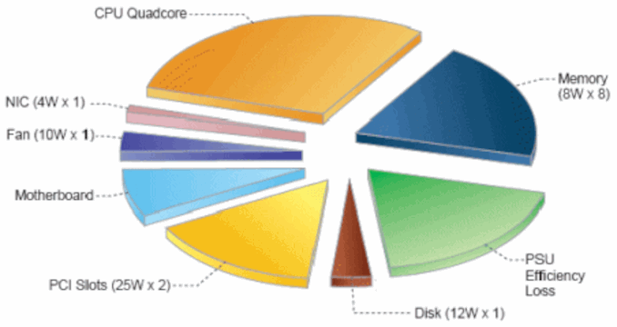
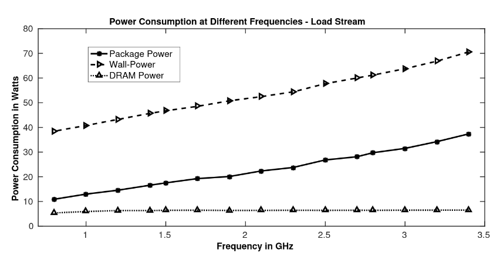

= Intel RAPL (Running Average Power Limit)

With the link:https://en.wikipedia.org/wiki/Sandy_Bridge[Sandy Bridge] link:https://en.wikipedia.org/wiki/List_of_Intel_CPU_microarchitectures[microarchitecture], Intel introduced a link:https://en.wikichip.org/wiki/intel/microarchitectures/sandy_bridge_(client)#Power[large number of power features].
As part of these changes, link:https://en.wikipedia.org/wiki/Model-specific_register[MSRs (model-specific registers)] were allocated for platform-specific power management and allow access to energy measurement and enforcement of power limits. In particular, Intel refers to these registers as the *Running Average Power Limit (RAPL)* interfaces. The RAPL interface exposes *multiple domains of power rationing within the entire SoC for each processor socket and for RAM*.

The *RAPL interface* provides multiple capabilities to *monitor* and *control system power and energy*.
The two capabilities, which are supported by all models are *Power Limit*, which allows it to specify power limits and time windows, and *Energy Status*, which is the power metering interface, providing energy consumption information.
For this document, only the _Energy Status_ capability is relevant.

The official _RAPL_ documentation can be found in the link:https://www.intel.com/content/www/us/en/developer/articles/technical/intel-sdm.html[Intel 64 and IA-32 Architectures Software Developer Manuals] in _Volume 3B_ section _15.10.1 RAPL Interfaces_.

The image is from the article link:https://www.infoq.com/articles/power-consumption-servers/[The Problem of Power Consumption in Servers] from 2009 and shows a power breakdown of a server by components. Based on this diagram, with RAPL on server platforms, we can measure only the energy consumption of two components illustrated in the diagram, which are CPU and memory. However, multiple papers suggest that energy measures from RAPL strongly correlate with the overall power consumption of the entire system (see link:https://helda.helsinki.fi/server/api/core/bitstreams/bdc6c9a5-74d4-494b-ae83-860625a665ce/content[RAPL in Action : Experiences in Using RAPL for Power Measurements]).
Therefore, it seems that with RAPL, we have a tool wich is able to measure energy consumption of CPU and memory with very high accuracy and estimate the energy consumption of the entire server with a low error. Those papers also showed that accuracy was drastically improved with the link:https://en.wikipedia.org/wiki/Haswell_(microarchitecture)[Haswell] microarchitecture.

*Acknowledgments*: The link:https://github.com/hubblo-org/scaphandre[Scaphandre project] mainly driven by link:https://github.com/bpetit[bpetit] and link:https://github.com/uggla[René Ribaud] (based on number of commits), the link:https://github.com/joular[Joular project] led by link:https://www.noureddine.org/[Adel Noureddine] from link:https://www.univ-pau.fr/[University of Pau and Pays de l'Adour], link:https://web.eece.maine.edu/~vweaver/[Vince Weaver] from link:https://ece.umaine.edu/[Electrical and Computer Engineering Department of the University of Maine], and from link:https://people.eecs.berkeley.edu/~demmel/[James Demmel] from link:https://cs.berkeley.edu/[Electrical Engineering and Computer Engineering Department of the University of California at Berkeley] and link:https://ep.jhu.edu/faculty/andrew-gearhart/[Andrew Gearhart] from link:https://ep.jhu.edu/programs/computer-science/[Johns Hopkins Whiting School of Engineering], and link:https://fi.linkedin.com/in/kashifnizamkhan[Kashif Nizam Khan] already provide a comprehensive documentation of RAPL.
This documentation is therefore heavily based on link:https://hubblo-org.github.io/scaphandre-documentation[Scaphandre documentation], link:https://joular.github.io/powerjoular/ref/how_it_works.html[PowerJoular documentation], link:https://web.eece.maine.edu/~vweaver/projects/rapl/[RAPL energy measurements from Linux documentation by Vince Weaver], the paper link:https://www2.eecs.berkeley.edu/Pubs/TechRpts/2012/EECS-2012-168.html[Instrumenting Linear Algebra Energy Consumption via On-chip Energy Counters by James Demmel and Andrew Gearhart], and the paper link:https://helda.helsinki.fi/server/api/core/bitstreams/bdc6c9a5-74d4-494b-ae83-860625a665ce/content[RAPL in Action : Experiences in Using RAPL for Power Measurements by Khan, Kashif Nizam].

*Hint*: Besides _RAPL_ there are other data sources for energy and power monitoring available. A good overview is provided by the paper link:https://dl.acm.org/doi/10.1145/2950290.2983956[A portable interface for runtime energy monitoring]. The paper is also available at the link:https://newtraell.cs.uchicago.edu/research/publications/techreports/TR-2016-08[Computer Science Department of the University of Chicago]. The general interface for energy and power monitoring they propose is available on the GitHub repository link:https://github.com/energymon/energymon[energymon].

== Domains

RAPL domains match parts of the _SoC_ as shown in the following images:

image::rapl_domains_package.png[]

The image is from link:https://raw.githubusercontent.com/powerapi-ng/pyJoules/master/rapl_domains.png[powerapi-ng/pyJoules] GitHub repository.

image::rapl_domains_complete.png[]

The image is from the paper link:https://helda.helsinki.fi/server/api/core/bitstreams/bdc6c9a5-74d4-494b-ae83-860625a665ce/content[RAPL in Action : Experiences in Using RAPL for Power Measurements] and shows all domains supported by RAPL.

* *package*: Measures the total energy consumption of the entire _socket_. It includes the consumption of all _CPU cores_, _integrated graphics_ and the _link:https://en.wikipedia.org/wiki/Uncore[uncore]_ components (e.g. last level caches and memory controller). The domains _Power plane PP0_ and _Power Plane PP1_ (may reflect all or a single component of the uncore). Supported since _Intel Sandy Bridge CPUs_. `energy(package)>= energy(PP0) + energy(PP1)`
** _Power plane PP0_ *(core)*: Measures the total energy consumption of all _CPU cores_ of the corresponding _socket_. RAPL does not support measuring the energy consumption of individual CPU cores. Each core has its own _MSRs_, but all cores show the same values for the RAPL counters. This domain is included in the _package_ domain value.
** _Power plane PP1_ *(uncore and/or integrated graphics)*: Measures the energy consumption of integrated graphics and/or the _uncore_ components of the corresponding _socket_. link:https://www.intel.com/content/www/us/en/developer/articles/technical/intel-sdm.html[Intel's Software Developer Manuals] state that the _PP1_
domain refers to the power plane of a specific device on the _uncore_. Therefore, it is not clear which devices are actually included in PP1. Very often, it was referred to as the energy consumption of the integrated graphics. However, this was not mentioned by Intel. In the paper link:https://www2.eecs.berkeley.edu/Pubs/TechRpts/2012/EECS-2012-168.html[Instrumenting Linear Algebra Energy Consumption via On-chip Energy Counters by James Demmel and Andrew Gearhart] it is stated that on _Sandy Bridge_ platforms _PP1_ measures the energy of the integrated graphics, while on all other platforms it measures the entire _uncore_. Intel states that _PP1_ domain is only available on desktop models. This domain is included in the _package_ domain value.
** *dram*: Measures the energy consumption of _RAM_ attached to the integrated memory controller of the corresponding _socket_. Intel states that the _dram_ domain is only supported by platforms targeting the server segment. This domain is *not* included in the _package_ domain value.

* *psys* (power of system): Measures the total energy consumption for the entire _SoC_ (including _package_ along with other components, such as _PCH_ and _eDRAM_). Unfortunately, Intel does not mention *psys* in their manuals, so it is not clear, what is actually included in *psys*. Supported since link:https://en.wikichip.org/wiki/intel/microarchitectures/skylake_(client)#Power_of_System_.28Psys.29[Intel Skylake CPUs]. `energy(psys) >= energy(package) + energy(dram)`

The specific RAPL domains available in a platform vary across product segments. Platforms targeting the *client segment* support the following RAPL domain hierarchy:

* *package*
** _Power planes PP0_ (*core*) and _PP1_ (*uncore*)
* *psys* (assumption, not mentioned in Intel's manual)

Platforms targeting the *server segment* support the following RAPL domain hierarchy:

* *package*
** _Power plane PP0_ (*core*)
** *dram*
* *psys* (assumption, not mentioned in Intel's manual)

*Hint:* The RAPL interface is described in the link:https://www.intel.com/content/www/us/en/developer/articles/technical/intel-sdm.html[Intel 64 and IA-32 Architectures Software Developer Manuals] in _Volume 3B_ section _15.10.1 RAPL Interfaces_.
Unfortunately, the manual only contains a documentation for the domains _package_, _PP0 (core)_, _PP1 (uncore)_ and _dram_. The domain _psys_ is completely missing.

*Important*: It is important to be aware of which domain is actually considered by the individual higher level measurement tools. Especially for tools which derives process level or even function level measurements. *_Psys_ is the most comprehensive source for energy measurements provided by RAPL. Therefore, to get the most accurate energy consumption this should be the preferred domain.* However, of course, *psys* and *package + dram* values are not comparable. So, be careful in comparing results of different CPU models. For example link:https://github.com/joular/powerjoular[PowerJoular] uses *psys* if available and fallback to *package + dram* otherwise.

*Remark*: There is still the question, which process metrics correlate best with which domain. For example, is it meaningful to break down energy consumption of _psys_ domain to individual processes by their CPU time-shares?

*Example*: The following print is a snapshot of the energy consumption of an _Alder Lake_ mobile processor (i7-1280P). It shows, that first, _dram_ domain is not available, and that second, _package_ is much larger as the sum of _PP0_ and _PP1_.

----
Psys:            49201079000
Package:         21872365149
  PP0 (Core):    16870850853
  PP1 (Uncore):    684455034
  PP0 + PP1:     17555305887
----

References:

* link:https://www.intel.com/content/www/us/en/developer/articles/technical/intel-sdm.html[Intel 64 and IA-32 Architectures Software Developer Manuals]
* link:https://www2.eecs.berkeley.edu/Pubs/TechRpts/2012/EECS-2012-168.html[Instrumenting Linear Algebra Energy Consumption via On-chip Energy Counters]
* link:https://helda.helsinki.fi/server/api/core/bitstreams/bdc6c9a5-74d4-494b-ae83-860625a665ce/content[RAPL in Action : Experiences in Using RAPL for Power Measurements]
* link:https://github.com/powerapi-ng/pyJoules[powerapi-ng/pyJoules]
* link:https://joular.github.io/powerjoular/ref/how_it_works.html[PowerJoular]

== Supported Platforms

Energy consumption data can be directly collected on a physical machine only.

Intel and AMD x86 CPUs, produced after 2012 are supported. However, the actual support depends on the operating system and used interface.

The _pts_ and _pln_ feature flags (_Intel Package Thermal Status_ and _Intel Power Limit Notification_ respectively) seem to indicate that RAPL is supported on a CPU.
On Linux, you can be sure of their presence, if this command succeeds and matches:

[source,bash]
----
egrep "(pts|pln)" /proc/cpuinfo
----

References:

* link:https://web.eece.maine.edu/~vweaver/projects/rapl/rapl_support.html[Incomplete list of CPUs and their Linux support for power measurement interfaces]

== Accuracy and Overhead

=== Package energy accuracy

In 2015, link:https://ieeexplore.ieee.org/document/7284406/[Hackenberg et al.] studied RAPL on the _Intel Haswell-EP platform_. They compared
the accuracy of RAPL between _Sandy Bridge-EP_ and _Haswell-EP_ and showed that _Haswell_ has improved RAPL measurements.
They also showed that *RAPL measurements correlate very well with external power measurements*.

In 2018, also link:https://helda.helsinki.fi/server/api/core/bitstreams/bdc6c9a5-74d4-494b-ae83-860625a665ce/content[Kashif Nizam Khan] could show a strong correlation between RAPL *package* domain and full system energy consumption from wall socket.

*Remark*: It would be interesting, to see, how *psys* domain energy consumption correlates with full system energy consumption from wall socket.

The image is from the paper link:https://helda.helsinki.fi/server/api/core/bitstreams/bdc6c9a5-74d4-494b-ae83-860625a665ce/content[RAPL in Action : Experiences in Using RAPL for Power Measurements] and shows power usage measurements of RAPL domains _package_ and _dram_ and external power from wall socket for the _Stream_ benchmark on a _Haswell_ machine.

=== DRAM energy accuracy

Initial findings suggested that RAPL DRAM values were unstable and unreliable for earlier versions of processors which included RAPL.
*Since the introduction of _Haswell_, RAPL DRAM values are now more reliable and follow a strong correlation with AC reference measurements.*
In 2018, also link:https://helda.helsinki.fi/server/api/core/bitstreams/bdc6c9a5-74d4-494b-ae83-860625a665ce/content[Kashif Nizam Khan] also showed in their analysis that DRAM measurements clearly improve accuracy.
Modeling the wall power using only CPU measurements gives 3.1% error, including DRAM measurements reduces this error to 1.7%.

=== Non-atomic register updates

In 2018, link:https://helda.helsinki.fi/server/api/core/bitstreams/bdc6c9a5-74d4-494b-ae83-860625a665ce/content[Kashif Nizam Khan] could also demonstrate, that there is a time delay between updates to different energy counters. This means, that the *RAPL updates are not atomic*. Therefore, at high sampling rates, it is possible to read both fresh and stale values of different counters.

=== Counter Overflows

The energy counters are limited to 32 bits even though the MSRs are 64-bit wide. Therefore, they will eventually overflow and start again counting from zero.
This can happen independently for each RAPL domain. Unfortunately, there is no overflow counter. So, the only way to keep track of the total energy consumption of the _SoC_ since the system has been started is to continuously poll.
It is important to be sure that higher-lever tools which are used handle overflows correctly. For example link:https://github.com/hubblo-org/scaphandre[Scaphandre] seems not to consider this at the moment (see link:https://github.com/hubblo-org/scaphandre/issues/280[Scaphandre issue #280]). Therefore, it may be, that during an overflow, the derived power values are incorrect.

=== Performance overhead

link:https://dl.acm.org/doi/10.1145/2834800.2834807[Huang et al.] evaluated RAPL for Haswell-EP processors and compared RAPL with traditional power monitoring tools. They showed that *monitoring with RAPL using the _Performance Application Programming Interface (PAPI)_ can consume 28.6% more power than an idle system*.
This is however when RAPL is monitored with all its 28 attributes and not all of these attributes are related to power or energy monitoring.
They also claimed that if RAPL is monitored with selected attributes (PKG, PP1, PP0, etc.), this power overhead can be reduced by 90%.
These measurements however do not account for the PAPI library’s power consumption and different granularities of RAPL measurements will also affect the energy overhead.

In 2018, also link:https://helda.helsinki.fi/server/api/core/bitstreams/bdc6c9a5-74d4-494b-ae83-860625a665ce/content[Kashif Nizam Khan] evaluated the performance overhead of RAPL measurements. At a sampling rate of the RAPL measurement tool of 1000Hz, the *maximum overhead was 1.2%*.
This is a much lower overhead as shown by link:https://dl.acm.org/doi/10.1145/2834800.2834807[Huang et al]. One reason for the high overhead could be the usage of _PAPI_. However, further investigations are required. Nevertheless, the low overhead makes sense, because RAPL calculations are implemented in hardware.

== Interfaces

There are *three* ways to read _RAPL_ energy consumption values on Linux (see link:https://web.eece.maine.edu/~vweaver/projects/rapl/[Reading RAPL energy measurements from Linux]):

=== Powercap

GitHub: https://github.com/powercap/powercap

As data source link:https://en.wikipedia.org/wiki/Model-specific_register[Intel MSR] via link:https://github.com/torvalds/linux/blob/master/drivers/powercap/intel_rapl_common.c[intel_rapl_common] and link:https://github.com/torvalds/linux/blob/master/drivers/powercap/intel_rapl_msr.c[intel_rapl_msr] kernel modules is used. You can check, if the modules are present with the command `lsmod | grep intel_rapl`.
The data type is link:https://energyeducation.ca/encyclopedia/Energy_vs_power[energy] and the unit of measurement is link:https://en.wikipedia.org/wiki/Joule[microjoules (uJ)].
The internal refresh interval is 1ms.
The interface is provided via link:https://en.wikipedia.org/wiki/Sysfs[sysfs] files under the virtual directory `/sys/class/powercap/`.

Since Linux kernel 5.4.0 _Powercap_ attributes are only accessible by _root_. This has been changed due to the security vulnerability link:https://www.cve.org/CVERecord?id=CVE-2020-8694[CVE-2020-8694].
It has been discovered by link:https://platypusattack.com/[Platypus] that RAPL can be used for software-based power side-channel attacks. This even allows to extract complete cryptographic keys based on the CPU power consumption.

You can print the _Powercap_ domain hierarchy, supported by a system with the following command:

[source,bash]
----
sudo cpupower powercap-info
----

The RAPL domains are mapped according to their hierarchy below the virtual folder `/sys/class/powercap`. A domain is mapped as a folder. The capabilities within a domain are all mapped as files.

----
/sys/class/powercap
|- [intel-rapl:0] (package-0)
|  |-- [intel-rapl:0:0] (cores)
|  |   |-- name
|  |   |-- energy_uj
|  |   └-- max_energy_range_uj
|  |-- [intel-rapl:0:1] (uncore)
|  |   |-- name
|  |   |-- energy_uj
|  |   └-- max_energy_range_uj
|  |-- [intel-rapl:0:2] (dram)
|  |   |-- name
|  |   |-- energy_uj
|  |   └-- max_energy_range_uj
|  |-- name
|  |-- energy_uj
|  └-- max_energy_range_uj
└- [intel-rapl:1] (psys)
   |-- name
   |-- energy_uj
   └-- max_energy_range_uj
----

The files shown in the previous directory tree provide the following capabilities:

* *name*:the name of the domain
* *energy_uj*: energy consumption in uJ
* *max_energy_range_uj*: value at which the counter will overflow

The name of a domain can be read from the file `name`.

[source,bash]
----
cat /sys/class/powercap/intel-rapl:0/name
----

The energy consumption in link:https://en.wikipedia.org/wiki/Joule[microjoules (uJ)] can be read from the file `energy_uj`.

For example, to get the energy consumption of _package-0_ in uJ, run the following command:

[source,bash]
----
sudo cat /sys/class/powercap/intel-rapl:0/energy_uj
----

*Important*: As already mentioned, the energy counters provided via `energy_uj` files will eventually overflow and start again counting from zero. This can happen independently for each RAPL domain. At which value it will overflow can be read from  the file `max_energy_range_uj` in the directory of the corresponding domain. Unfortunately, there is no overflow counter. So, the only way to keep track of the total energy consumption of the _SoC_ since the system has been started is to continuously poll. On my system for example `max_energy_range_uj` is set to `262143328850 Microjoules`, which is ~`72.82 Watt-hours`. Therefore, on a high power CPU with 150-300W consumption, it may take 15-30 minutes to overflow (see _link:https://github.com/powercap/powercap/issues/3#issuecomment-637208640[Powercap issue #3 comment by amkozlov]_).
It is also important to be sure that higher-lever tools which are used handle overflows correctly. For example link:https://github.com/hubblo-org/scaphandre[Scaphandre] seems not to consider this at the moment (see link:https://github.com/hubblo-org/scaphandre/issues/280[Scaphandre issue #280]). Therefore, it may be, that during an overflow, the derived power values are incorrect.

*Hint*: As previously mentioned, the _Powercap_ files can only be accessed with _root_ permissions.
It is possible to link:https://github.com/mlco2/codecarbon/issues/244[enable unprivileged access] with the help of `sysfsutils`.
To enable unprivileged access to all domains, add the following lines to the file `/etc/sysfs.conf` and reboot.

./etc/sysfs.conf
----
mode class/powercap/intel-rapl:0/energy_uj = 0444
mode class/powercap/intel-rapl:0:0/energy_uj = 0444
mode class/powercap/intel-rapl:0:1/energy_uj = 0444
mode class/powercap/intel-rapl:0:2/energy_uj = 0444
mode class/powercap/intel-rapl:1/energy_uj = 0444
----

Alternatively, you could also create a custom group `power` to link:https://github.com/mlco2/codecarbon/issues/244#issuecomment-1645622665[restrict permissions to this group].

./etc/sysfs.conf
----
mode class/powercap/intel-rapl:0/energy_uj = 0440
owner class/powercap/intel-rapl:0/energy_uj = root:power
----

However, be aware of the vulnerabilities described by link:https://platypusattack.com/[Platypus] when considering to enable unprivileged access to RAPL.

=== perf_event

Using the _perf_event_ interface with Linux 3.14 or newer.

This requires _root_ permissions or a _paranoid_ less than 1.

The following command measures the energy consumption of the _package_ domain in uJ of the _stress-ng_ command:

[sorce,bash]
----
sudo perf stat -e power/energy-pkg/ stress-ng -c 2 -t 10
----

Available events can be found via `perf list --unit power pmu` or under _/sys/bus/event_source/devices/power/events/_.

----
power/energy-pkg/     [Kernel PMU event]
power/energy-cores/   [Kernel PMU event]
power/energy-gpu/     [Kernel PMU event]
power/energy-psys/    [Kernel PMU event]
----

*Important*: Usage of Performance Counters for Linux (perf_events) can impose a considerable risk of leaking sensitive data accessed by monitored processes (see link:https://www.kernel.org/doc/html/latest/admin-guide/perf-security.html[Perf events and tool security]).

=== Raw-access to the underlying MSRs

As data source link:https://en.wikipedia.org/wiki/Model-specific_register[Intel MSR] via _msr_ kernel module is used.
The data type is link:https://energyeducation.ca/encyclopedia/Energy_vs_power[energy] and the unit of measurement is platform-specific.
The internal refresh interval is 1ms.
The interface is provided via link:https://en.wikipedia.org/wiki/Device_file[dev] files _/dev/cpu/<CPU_ID>/msr_.

Accessing _MSRs_ requires _root_ permissions. With the kernel module link:https://github.com/LLNL/msr-safe[msr-safe] read access for specific registers can be assigned to trusted users.

As the name _MSR (Model-specific register)_ suggests, the registers which must be read are model-specific. In addition, also the unit of measurement depends on the model. Be aware that the unit which is used also is not a typical energy unit like _microjoules_ or _watt-minutes_. The value must be multiplied with another model-specific value to get the actual unit (e.g _Sandy Bridge_ uses energy units of 15.3 μJ, whereas _Haswell_ and _Skylake_ uses units of 61 μJ).
For this reason higher-level interfaces like _Powercap_ have to add custom implementation for every single supported CPU model (see link:https://github.com/powercap/raplcap/blob/master/msr/raplcap-cpuid.h[raplcap-cpuid.h]).

The MSR interface is described in detail in the official _RAPL_ documentation which can be found in the link:https://www.intel.com/content/www/us/en/developer/articles/technical/intel-sdm.html[Intel 64 and IA-32 Architectures Software Developer Manuals] in _Volume 3B_ section _15.10.1 RAPL Interfaces_.
Unfortunately, the manual only contains a documentation for the domains _package_, _PP0 (core)_, _PP1 (uncore)_ and _dram_. The domain _psys_ is completely missing.

The demo code link:https://github.com/deater/uarch-configure/blob/master/rapl-read/rapl-read.c[rapl-read.c] from Vince Weaver shows how RAPL values can be read via _Intel MSR_. This code contains registers and units for some CPU models.

*Hint*: To read from _MSR_ on Linux, the tool `rdmsr` can be used. It can be installed on Fedora via the `msr-tools` package.

== CLI

=== cpupower

GitHub: https://github.com/torvalds/linux/blob/master/tools/power/cpupower/README

View Powercap control type hierarchies or zone/constraint-specific configurations:

[source,bash]
----
sudo cpupower powercap-info
----

Report power consumption of all available _RAPL_ domains:

[source,bash]
----
sudo cpupower monitor -m RAPL
----

Install:

* Fedora: `dnf install kernel-tools`

=== turbostat

GitHub: https://github.com/torvalds/linux/blob/master/tools/power/x86/turbostat/turbostat.c

_turbostats_ collects and prints values of all available _RAPL_ domains.

Measure energy consumption of _stress-ng_ tool:

[source,bash]
----
sudo turbostat --Joules stress-ng -c 2 -t 10
sudo turbostat --Joules stress-ng --memrate 2 --memrate-bytes 10000000000 -t 60
----

Install:

* Fedora: `dnf install kernel-tools`

=== PowerJoular

GitHub: https://github.com/joular/powerjoular

_PowerJoular_ is a command line software to monitor, in real time, the power consumption of software and hardware components.
_PowerJoular_ supports monitoring specific processes based on the _PID_ or its name.

As data source _PowerJoular_ will exclusively use the *psys* RAPL domain, if *psys* is supported. Otherwise, it will fall back to the *package* and *dram* RAPL domains.

Documentation: https://joular.github.io/powerjoular/ref/how_it_works.html

=== EnergyMon

GitHub: https://github.com/energymon/energymon

_EnergyMon_ provides a general C interface for energy monitoring utilities. Besides others, it supports also _RAPL_.
_EnergyMon_ can be used as library, but also includes CLI tools.

As data source for _RAPL_, the *package* domain is used (see link:https://github.com/energymon/energymon/tree/master/rapl[RAPL Energy Monitor]).

CLI tools provided by _EnergyMon_:

* `energymon-cmd-profile`: Prints out time, energy, and power statistics for the execution of a given shell command.
* `energymon-power-poller`: Prints average power values at the requested interval for the previous interval period.

Paper: link:https://newtraell.cs.uchicago.edu/research/publications/techreports/TR-2016-08[A portable interface for runtime energy monitoring]

== Exporters

In this section, measurement tools are listed, which can expose measurements as metrics, e.g. Prometheus:

* link:https://github.com/hubblo-org/scaphandre[Scaphandre]
* link:https://github.com/prometheus/node_exporter[Node Exporter]

The following exportes seems to support RAPL, but have not been analysed:

* link:https://sustainable-computing.io/[Kepler]
* link:https://www.elastic.co/guide/en/beats/metricbeat/current/metricbeat-metricset-linux-rapl.html[Elastic Metricbeat (Linux RAPL module)]

=== Scaphandre

GitHub: https://github.com/hubblo-org/scaphandre

Collects and exposes power consumption metrics of the overall RAPL domains and individual processes and containers.

Documentation:

* link:https://hubblo-org.github.io/scaphandre-documentation/references/sensor-powercap_rapl.html[Powercap_rapl sensor]

Bugs:

* link:https://github.com/hubblo-org/scaphandre/issues/280[Detect and correct overflows of the RAPL microjoule counter #280]: As mentioned previously the RAPL energy counters eventually overflow. Currently, this overflow is link:https://github.com/hubblo-org/scaphandre/blob/5c8d63c09c1f2e6a934adef469d0bc7a06e694ea/src/sensors/mod.rs#L965[not handled]. Therefore, it may be, that during an overflow, the derived power values are incorrect.

[source,bash]
----
docker run --name scaphandre --rm \
  -p 8080:8080 \
  --mount type=bind,source=/sys,target=/sys,readonly \
  --mount type=bind,source=/proc,target=/proc,readonly \
  --mount type=bind,source=/var/run/docker.sock,target=/var/run/docker.sock,readonly \
  --privileged \
  hubblo/scaphandre:0.5.0 prometheus --containers
----

[source,bash]
----
curl localhost:8080/metrics | grep microjoules
curl localhost:8080/metrics | grep microwatts
----

[source,yaml]
----
scaphandre:
  container_name: scaphandre
  hostname: scaphandre
  image: hubblo/scaphandre:0.5.0
  restart: always
  ports:
    - "9500:8080"
  privileged: true
  volumes:
    - /proc:/proc:ro
    - /sys:/sys:ro
    - /var/run/docker.sock:/var/run/docker.sock:ro
  command: ["prometheus", "--containers"]
----

==== Measurements (0.5.0)

Implementation: https://github.com/hubblo-org/scaphandre/blob/v0.5.0/src/exporters/mod.rs#L410

=== Node Exporter

Prometheus exporter for hardware and OS metrics.
Besides many others, it also exposes various statistics from `/sys/class/powercap`.
It only exposes power consumption metrics of the overall RAPL domains (psys, package, core, uncore and dram), but not of the individual processes.

GitHub: https://github.com/prometheus/node_exporter

[source,bash]
----
docker run --name node-exporter --rm \
  --net host --pid host --user root --privileged \
  --mount type=bind,source=/,target=/rootfs,readonly,bind-propagation=rslave \
  quay.io/prometheus/node-exporter:v1.6.1 --path.rootfs=/rootf
----

[source,bash]
----
curl localhost:9100/metrics | grep rapl
----

[source,yaml]
----
node_exporter:
  container_name: node_exporter
  hostname: node_exporter
  image: quay.io/prometheus/node-exporter:v1.6.1
  restart: always
  network_mode: host
  pid: host
  user: root
  privileged: true
  volumes:
    - /:/rootfs:ro,rslave
  command:
    - '--path.rootfs=/rootfs'
----

== Libraries

=== pyJoules

GitHub: https://github.com/powerapi-ng/pyJoules

=== pyRAPL

GitHub: https://github.com/powerapi-ng/pyRAPL

=== JoularJX

GitHub: https://github.com/joular/joularjx

Documentation: https://joular.github.io/joularjx/ref/how_it_works.html

The paper link:https://www.noureddine.org/research/jalen-unit[Unit Testing of Energy Consumption of Software Libraries] in addition proposes a Unit-Test framework on top of _JoularJX_ (previously known as link:https://www.noureddine.org/research/jalen[Jalen]).