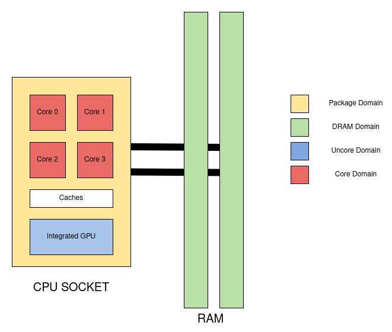

= Intel RAPL (Running Average Power Limit)

With _Sandy Bridge_, Intel introduced a link:https://en.wikichip.org/wiki/intel/microarchitectures/sandy_bridge_(client)#Power[large number of power features].
As part of these changes, link:https://en.wikipedia.org/wiki/Model-specific_register[MSRs (model-specific registers)] were allocated for platform-specific power management and allow access to energy measurement and enforcement of power limits. In particular, Intel refers to these registers as the *Running Average Power Limit (RAPL)* interfaces. The RAPL interface exposes multiple domains of power rationing within each processor socket.

The *RAPL interface* provides multiple capabilities to *monitor* and *control system power and energy*.
The two capabilities, which are supported by all models are *Power Limit*, which allows it to specify power limits and time windows, and *Energy Status*, which is the power metering interface, providing energy consumption information.
For this document, only the _Energy Status_ capability is relevant.

The official _RAPL_ documentation can be found in the link:https://www.intel.com/content/www/us/en/developer/articles/technical/intel-sdm.html[Intel 64 and IA-32 Architectures Software Developer Manuals] in _Volume 3B_ section _15.10.1 RAPL Interfaces_.

*Acknowledgments*: The link:https://github.com/hubblo-org/scaphandre[Scaphandre project] mainly driven by link:https://github.com/bpetit[bpetit] and link:https://github.com/uggla[René Ribaud] (based on number of commits), the link:https://github.com/joular[Joular project] led by link:https://www.noureddine.org/[Adel Noureddine] from link:https://www.univ-pau.fr/[University of Pau and Pays de l'Adour],  link:https://web.eece.maine.edu/~vweaver/[Vince Weaver] from link:https://ece.umaine.edu/[Electrical and Computer Engineering Department of the University of Maine], and from link:https://people.eecs.berkeley.edu/~demmel/[James Demmel] from link:https://cs.berkeley.edu/[Electrical Engineering and Computer Engineering Department of the University of California at Berkeley] and link:https://ep.jhu.edu/faculty/andrew-gearhart/[Andrew Gearhart] from link:https://ep.jhu.edu/programs/computer-science/[Johns Hopkins Whiting School of Engineering] already provide a comprehensive documentation of RAPL.
This documentation is therefore heavily based on link:https://hubblo-org.github.io/scaphandre-documentation[Scaphandre documentation], link:https://joular.github.io/powerjoular/ref/how_it_works.html[PowerJoular documentation], link:https://web.eece.maine.edu/~vweaver/projects/rapl/[RAPL energy measurements from Linux documentation by Vince Weaver] and the paper link:https://www2.eecs.berkeley.edu/Pubs/TechRpts/2012/EECS-2012-168.html[Instrumenting Linear Algebra Energy Consumption via On-chip Energy Counters by James Demmel and Andrew Gearhart].

*Hint*: Besides _RAPL_ there are other data sources for energy and power monitoring available. A good overview is provided by the paper link:https://dl.acm.org/doi/10.1145/2950290.2983956[A portable interface for runtime energy monitoring]. The paper is also available at the link:https://newtraell.cs.uchicago.edu/research/publications/techreports/TR-2016-08[Computer Science Department of the University of Chicago]. The general interface for energy and power monitoring they propose is available on the GitHub repository link:https://github.com/energymon/energymon[energymon].

== RAPL Domains

RAPL domains match parts of the _SoC_ as shown in the following images:

The image is from link:https://raw.githubusercontent.com/powerapi-ng/pyJoules/master/rapl_domains.png[powerapi-ng/pyJoules] GitHub repository.

image::rapl_domains_complete.png[]

The image is from the paper link:https://helda.helsinki.fi/server/api/core/bitstreams/bdc6c9a5-74d4-494b-ae83-860625a665ce/content[RAPL in Action : Experiences in Using RAPL for Power Measurements].

* *package*: Sum of the energy consumption of _PP0_ (_CPU cores_) and _PP1_ (may reflect the devices or a single device on the link:https://en.wikipedia.org/wiki/Uncore[uncore]). The latter one for example encompasses _integrated graphics_, _memory controller_ and _last level caches_ per _socket_. Supported since _Intel Sandy Bridge CPUs_. `energy(package)>= energy(PP0) + energy(PP1)`
** _Power plane PP0_ *(core)*: Sum of the energy consumption of all _CPU cores_ of the corresponding _socket_. This domain is included in the _package_ domain value.
** _Power plane PP1_ *(uncore)*: Energy consumption of _uncore devices_ of the corresponding _socket_. link:https://www.intel.com/content/www/us/en/developer/articles/technical/intel-sdm.html[Intel's Software Developer Manuals] state that the _PP1_
domain refers to the power plane of a specific device on the _uncore_. Therefore, it is not clear which devices are actually included in PP1. Very often, it was referred to as the energy consumption of the integrated graphics. However, this was not mentioned by Intel. In the paper link:https://www2.eecs.berkeley.edu/Pubs/TechRpts/2012/EECS-2012-168.html[Instrumenting Linear Algebra Energy Consumption via On-chip Energy Counters by James Demmel and Andrew Gearhart] it is stated that on _Sandy Bridge_ platforms _PP1_ measures the energy of the integrated graphics, while on all other platforms it measures the entire _uncore_. This domain is included in the _package_ domain value.
** *dram*: _RAM_ attached to the memory controller of the corresponding _socket_. This domain is *not* included in the _package_ domain value.

* *psys* (power of system): Sum of the energy consumption for the entire _SoC_ (including _package_ along with other components, such as _PCH_ and _eDRAM_). Unfortunately, Intel does not mention *psys* in their manuals, so it is not clear, what is actually included in *psys*. Supported since link:https://en.wikichip.org/wiki/intel/microarchitectures/skylake_(client)#Power_of_System_.28Psys.29[Intel Skylake CPUs]. `energy(psys) >= energy(package) + energy(dram)`

The specific RAPL domains available in a platform vary across product segments. Platforms targeting the client segment support the following RAPL domain hierarchy:

* *package*
** _Power planes PP0_ (*core*) and _PP1_ (*uncore*)
* *psys* (assumption, not mentioned in Intel's manual)

Platforms targeting the server segment support the following RAPL domain hierarchy:

* *package*
** _Power plane PP0_ (*core*)
** *dram*
* *psys* (assumption, not mentioned in Intel's manual)

*Hint:* The RAPL interface is described in the link:https://www.intel.com/content/www/us/en/developer/articles/technical/intel-sdm.html[Intel 64 and IA-32 Architectures Software Developer Manuals] in _Volume 3B_ section _15.10.1 RAPL Interfaces_.
Unfortunately, the manual only contains a documentation for the domains _package_, _PP0 (core)_, _PP1 (uncore)_ and _dram_. The domain _psys_ is completely missing.

*Important*: It is important to be aware of which domain is actually considered by the individual higher level measurement tools. Especially for tools which derives process level or even function level measurements. *_Psys_ is the most comprehensive source for energy measurements provided by RAPL. Therefore, to get the most accurate energy consumption this should be the preferred domain. Nevertheless, it seems that it is more difficult to derive process level measurements for _psys_ than just for _core_.* However, of course, *psys* and *package + dram* values are not comparable. So, be careful in comparing results of different CPU models. For example link:https://github.com/joular/powerjoular[PowerJoular] uses *psys* if available and fallback to *package + dram* otherwise.

References:

* https://www.intel.com/content/www/us/en/developer/articles/technical/intel-sdm.html
* https://www2.eecs.berkeley.edu/Pubs/TechRpts/2012/EECS-2012-168.html
* https://github.com/powerapi-ng/pyJoules
* https://joular.github.io/powerjoular/ref/how_it_works.html

== Supported Platforms

Energy consumption data can be directly collected on a physical machine only.

Intel and AMD x86 CPUs, produced after 2012 are supported. However, the actual support depends on the operating system and used interface.

The _pts_ and _pln_ feature flags ("Intel Package Thermal Status" and "Intel Power Limit Notification" respectively) seem to indicate that RAPL is supported on a CPU.
On GNU/Linux, you could be sure of their presence, if this command succeeds and matches:

[source,bash]
----
egrep "(pts|pln)" /proc/cpuinfo
----

References:

* link:https://web.eece.maine.edu/~vweaver/projects/rapl/rapl_support.html[
Incomplete list of CPUs and their Linux support for power measurement interfaces]

== Interfaces

There are *three* ways to read _RAPL_ energy consumption values on Linux.

References:

* link:https://web.eece.maine.edu/~vweaver/projects/rapl/[Reading RAPL energy measurements from Linux]

=== Powercap

GitHub: https://github.com/powercap/powercap

As data source link:https://en.wikipedia.org/wiki/Model-specific_register[Intel MSR] via link:https://github.com/torvalds/linux/blob/master/drivers/powercap/intel_rapl_common.c[intel_rapl_common] and link:https://github.com/torvalds/linux/blob/master/drivers/powercap/intel_rapl_msr.c[intel_rapl_msr] kernel modules is used.
The data type is link:https://energyeducation.ca/encyclopedia/Energy_vs_power[energy] and the unit of measurement is link:https://en.wikipedia.org/wiki/Joule[microjoules (uJ)].
The internal refresh interval is 1ms.
The interface is provided via link:https://en.wikipedia.org/wiki/Sysfs[sysfs] files under the virtual directory _/sys/class/powercap/intel-rapl_.

Since Linux kernel package 5.4.0-53.59 in debian/ubuntu, Powercap attributes are only accessible by root:

----
linux (5.4.0-53.59) focal; urgency=medium

  * CVE-2020-8694
    - powercap: make attributes only readable by root
----

https://github.com/mlco2/codecarbon/issues/244

*Important*: Access to the energy consumption values has been restricted since Linux kernel 5.4.0, because it has been discovered by link:https://platypusattack.com/[Platypus] that RAPL can be used for software-based power side-channel attacks. This even allows to extract complete cryptographic keys based on the CPU power consumption. Actually, this is very impressive and fascinating. However, be aware of this when considering to enable unprivileged access to RAPL.

_Powercap_ needs the following kernel modules to be present and running:

* On kernels 5.0 or later: `intel_rapl_common`
* On kernels prior 5.0: `intel_rapl`

You can check, if one of the modules is present with the command `lsmod | grep intel_rapl`.

`/sys/class/powercap/intel-rapl`

----
|-intel-rapl:0 package-0    ->  (CPU socket)
| |-- intel-rapl:0:0 cores  ->  (CPU cores, per socket)
| |-- intel-rapl:0:1 uncore ->  (integrated graphics, per socket)
| |-- intel-rapl:0:2 dram   ->  (memory, per socket, but *not* included in package value above)
|-intel-rapl:1 psys         ->  (whole system, ie includes package and dram)
----

https://github.com/powercap/powercap/issues/3

You can print the _Powercap_ domain hierarchy, supported by a system with the following command:

[source,bash]
----
sudo cpupower powercap-info
----

The name of a domain can be read from the file `name`.

[source,bash]
----
cat /sys/class/powercap/intel-rapl:0/name
----

The energy consumption in link:https://en.wikipedia.org/wiki/Joule[microjoules (uJ)] can be read from the file `energy_uj`.

For example, to get the energy consumption of _package-0_ in uJ, run the following command:

[source,bash]
----
sudo cat /sys/class/powercap/intel-rapl:0/energy_uj
----

*Important*: Be aware that the energy counters in `energy_uj` files will eventually overflow, which means they start again counting from zero. This can happen independently for each RAPL domain. At which value it will overflow can be read from  the file `max_energy_range_uj` in the directory of the corresponding domain. Unfortunately, there is no overflow counter. So, the only way to keep track of the total energy consumption of the _SoC_ since the system has been started is to continuously poll. On my system for example `max_energy_range_uj` is set to `262143328850 Microjoules`, which is ~`72.82 Watt-hours`. Therefore, on a high power CPU with 150-300W consumption, it may take 15-30 minutes to overflow (see _link:https://github.com/powercap/powercap/issues/3#issuecomment-637208640[Powercap issue #3 comment by amkozlov]_).
It is also important to be sure that higher-lever tools which are used handle overflows correctly. For example link:https://github.com/hubblo-org/scaphandre[Scaphandre] seems not to consider this at the moment (see link:https://github.com/hubblo-org/scaphandre/issues/280[Scaphandre issue #280]). Therefore, it may be, that during an overflow, the derived power values are incorrect.

=== perf_event

Using the _perf_event_ interface with Linux 3.14 or newer.

This requires _root_ or a _paranoid_ less than 1.

[sorce,bash]
----
sudo perf stat -a -e "power/energy-cores/" /bin/ls
----

Available events can be found via `perf list` or under _/sys/bus/event_source/devices/power/events/_.

=== Raw-access to the underlying MSRs

As data source link:https://en.wikipedia.org/wiki/Model-specific_register[Intel MSR] via _msr_ kernel module is used.
The data type is link:https://energyeducation.ca/encyclopedia/Energy_vs_power[energy] and the unit of measurement is platform-specific.
The internal refresh interval is 1ms.
The interface is provided via link:https://en.wikipedia.org/wiki/Device_file[dev] files _/dev/cpu/<CPU_ID>/msr_.

Accessing _MSRs_ requires _root_ permissions.

As the name _MSR (Model-specific register)_ suggests, the registers which must be read are model-specific. In addition, also the unit of measurement depends on the model. Be aware that the unit which is used also is not a typical energy unit like _microjoules_ or _watt-minutes_. The value must be multiplied with another model-specific value to get the actual unit like _microjoules_.
For this reason higher-level interfaces like _Powercap_ have to add custom implementation for every single supported CPU model (see link:https://github.com/powercap/raplcap/blob/master/msr/raplcap-cpuid.h[raplcap-cpuid.h]).

The MSR interface is described in detail in the official _RAPL_ documentation which can be found in the link:https://www.intel.com/content/www/us/en/developer/articles/technical/intel-sdm.html[Intel 64 and IA-32 Architectures Software Developer Manuals] in _Volume 3B_ section _15.10.1 RAPL Interfaces_.
Unfortunately, the manual only contains a documentation for the domains _package_, _PP0 (core)_, _PP1 (uncore)_ and _dram_. The domain _psys_ is completely missing.

The demo code link:https://github.com/deater/uarch-configure/blob/master/rapl-read/rapl-read.c[rapl-read.c] from Vince Weaver shows how RAPL values can be read via _Intel MSR_. This code contains registers and units for some CPU models.

*Hint*: To read from _MSR_ on Linux, the tool `rdmsr` can be used. It can be installed on Fedora via the `msr-tools` package.

== CLI

=== cpupower

GitHub: https://github.com/torvalds/linux/blob/master/tools/power/cpupower/README

View Powercap control type hierarchies or zone/constraint-specific configurations:

[source,bash]
----
sudo cpupower powercap-info
----

Report power consumption of all available _RAPL_ domains:

[source,bash]
----
sudo cpupower monitor -m RAPL
----

Install:

* Fedora: `dnf install kernel-tools`

=== turbostat

GitHub: https://github.com/torvalds/linux/blob/master/tools/power/x86/turbostat/turbostat.c

_turbostats_ collects and prints values of all available _RAPL_ domains.

Install:

* Fedora: `dnf install kernel-tools`

=== PowerJoular

_PowerJoular_ is a command line software to monitor, in real time, the power consumption of software and hardware components.
_PowerJoular_ supports monitoring specific processes based on the _PID_ or its name.

GitHub: https://github.com/joular/powerjoular

Documentation: https://joular.github.io/powerjoular/ref/how_it_works.html

As data source _PowerJoular_ will exclusively use the *psys* RAPL domain, if *psys* is supported. Otherwise, it will fall back to the *package* and *dram* RAPL domains.

=== EnergyMon

_EnergyMon_ provides a general C interface for energy monitoring utilities. Besides others, it supports also _RAPL_.
_EnergyMon_ can be used as library, but also includes CLI tools.

GitHub: https://github.com/energymon/energymon

Paper: link:https://newtraell.cs.uchicago.edu/research/publications/techreports/TR-2016-08[A portable interface for runtime energy monitoring]

As data source for _RAPL_, the *package* domain is used (see link:https://github.com/energymon/energymon/tree/master/rapl[RAPL Energy Monitor]).

CLI tools provided by _EnergyMon_:

* `energymon-cmd-profile`: Prints out time, energy, and power statistics for the execution of a given shell command.
* `energymon-power-poller`: Prints average power values at the requested interval for the previous interval period.

== Exporters

In this section, measurement tools are listed, which can expose measurements as metrics, e.g. Prometheus.

* link:https://github.com/hubblo-org/scaphandre[Scaphandre]
* link:https://github.com/prometheus/node_exporter[Node Exporter]

=== Scaphandre

Collects and exposes power consumption metrics of the overall RAPL domains and individual processes and containers.

GitHub: https://github.com/hubblo-org/scaphandre

Documentation:

* link:https://hubblo-org.github.io/scaphandre-documentation/references/sensor-powercap_rapl.html[Powercap_rapl sensor]

Bugs:

* link:https://github.com/hubblo-org/scaphandre/issues/280[Detect and correct overflows of the RAPL microjoule counter #280]: As mentioned previously the RAPL energy counters eventually overflow. Currently, this overflow is link:https://github.com/hubblo-org/scaphandre/blob/5c8d63c09c1f2e6a934adef469d0bc7a06e694ea/src/sensors/mod.rs#L965[not handled]. Therefore, it may be, that during an overflow, the derived power values are incorrect.

[source,bash]
----
docker run --name scaphandre --rm \
  -p 8080:8080 \
  --mount type=bind,source=/sys,target=/sys,readonly \
  --mount type=bind,source=/proc,target=/proc,readonly \
  --mount type=bind,source=/var/run/docker.sock,target=/var/run/docker.sock,readonly \
  --privileged \
  hubblo/scaphandre:0.5.0 prometheus --containers
----

[source,bash]
----
curl localhost:8080/metrics | grep microjoules
curl localhost:8080/metrics | grep microwatts
----

[source,yaml]
----
scaphandre:
  container_name: scaphandre
  hostname: scaphandre
  image: hubblo/scaphandre:0.5.0
  restart: always
  ports:
    - "9500:8080"
  privileged: true
  volumes:
    - /proc:/proc:ro
    - /sys:/sys:ro
    - /var/run/docker.sock:/var/run/docker.sock:ro
  command: ["prometheus", "--containers"]
----

==== Measurements (0.5.0)

Implementation: https://github.com/hubblo-org/scaphandre/blob/v0.5.0/src/exporters/mod.rs#L410

=== Node Exporter

Prometheus exporter for hardware and OS metrics.
Besides many others, it also exposes various statistics from `/sys/class/powercap`.
It only exposes power consumption metrics of the overall RAPL domains (psys, package, core, uncore and dram), but not of the individual processes.

GitHub: https://github.com/prometheus/node_exporter

[source,bash]
----
docker run --name node-exporter --rm \
  --net host --pid host --user root --privileged \
  --mount type=bind,source=/,target=/rootfs,readonly,bind-propagation=rslave \
  quay.io/prometheus/node-exporter:v1.6.1 --path.rootfs=/rootf
----

[source,bash]
----
curl localhost:9100/metrics | grep rapl
----

[source,yaml]
----
node_exporter:
  container_name: node_exporter
  hostname: node_exporter
  image: quay.io/prometheus/node-exporter:v1.6.1
  restart: always
  network_mode: host
  pid: host
  user: root
  privileged: true
  volumes:
    - /:/rootfs:ro,rslave
  command:
    - '--path.rootfs=/rootfs'
----

== Libraries

=== pyJoules

GitHub: https://github.com/powerapi-ng/pyJoules

=== pyRAPL

GitHub: https://github.com/powerapi-ng/pyRAPL

=== JoularJX

GitHub: https://github.com/joular/joularjx

Documentation: https://joular.github.io/joularjx/ref/how_it_works.html

The paper link:https://www.noureddine.org/research/jalen-unit[Unit Testing of Energy Consumption of Software Libraries] in addition proposes a Unit-Test framework on top of _JoularJX_ (previously known as link:https://www.noureddine.org/research/jalen[Jalen]).