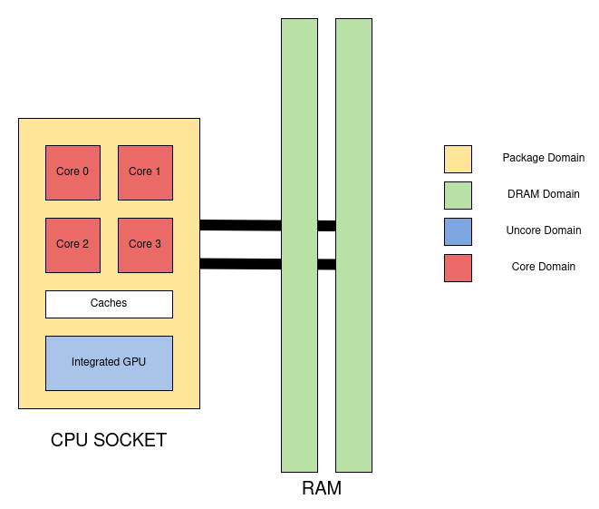

= RAPL

== Overview

RAPL domains:  https://raw.githubusercontent.com/powerapi-ng/pyJoules/master/rapl_domains.png

== Supported Platforms

Energy consumption data can be directly collected on a physical machine only.

Intel and AMD x86 CPUs, produced after 2012 are supported. However, the actual support depends on the operating system and used API.

References:

* link:https://web.eece.maine.edu/~vweaver/projects/rapl/rapl_support.html[
Incomplete list of CPUs and their Linux support for power measurement interfaces]

== Interfaces

There are *three* ways to read RAPL results on Linux.

References:

* link:https://web.eece.maine.edu/~vweaver/projects/rapl/[Reading RAPL energy measurements from Linux]

=== Powercap

GitHub: https://github.com/powercap/powercap

Reading the files under `/sys/class/powercap/intel-rapl/intel-rapl:0` using the _Powercap_ interface.

Since linux kernel package 5.4.0-53.59 in debian/ubuntu, powercap attributes are only accessible by root:

----
linux (5.4.0-53.59) focal; urgency=medium

  * CVE-2020-8694
    - powercap: make attributes only readable by root
----

https://github.com/mlco2/codecarbon/issues/244

_Powercap_ needs the following kernel modules to be present and running:

* On kernels 5.0 or later: `intel_rapl_common`
* On kernel prior 5.0: `intel_rapl`

You can check, if one of the modules is present with the command `lsmod | grep intel_rapl`.

=== perf_event

Using the _perf_event_ interface with Linux 3.14 or newer.

This requires root or a paranoid less than 1 (as do all system wide measurements with -a)

sudo perf stat -a -e "power/energy-cores/" /bin/ls Available events can be found via perf list or under /sys/bus/event_source/devices/power/events/

=== Raw-access to the underlying MSRs

Using raw-access to the underlying MSRs under /dev/msr.

This requires root. Some HPC tools will attempt to use this interface to bypass the kernel, but the kernel developers want to make raw MSR access go away as there are a lot of questionable things you can do to a system with raw MSR access.

== CLI

=== cpupower

GitHub: https://github.com/torvalds/linux/blob/master/tools/power/cpupower/README

View Powercap control type hierarchies or zone/constraint-specific configurations:

[source,bash]
----
sudo cpupower powercap-info
----

Report power consumption of RAPL domains:

[source,bash]
----
sudo cpupower monitor -m RAPL
----

Install:

* Fedora: `dnf install kernel-tools`

=== turbostat

GitHub: https://github.com/torvalds/linux/blob/master/tools/power/x86/turbostat/turbostat.c

Install:

* Fedora: `dnf install kernel-tools`

== Prometheus Exporters

In this section, measurement tools are listed, which can expose measurements as prometheus metrics.

* link:https://github.com/hubblo-org/scaphandre[Scaphandre]
* link:https://github.com/prometheus/node_exporter[Node Exporter]

=== Scaphandre

Collects and exposes power consumption metrics of the overall RAPL domains and individual processes and containers.

GitHub: https://github.com/hubblo-org/scaphandre

Documentation:

* link:https://hubblo-org.github.io/scaphandre-documentation/references/sensor-powercap_rapl.html[Powercap_rapl sensor]

[source,bash]
----
docker run --name scaphandre --rm \
  -p 8080:8080 \
  --mount type=bind,source=/sys,target=/sys,readonly \
  --mount type=bind,source=/proc,target=/proc,readonly \
  --mount type=bind,source=/var/run/docker.sock,target=/var/run/docker.sock,readonly \
  --privileged \
  hubblo/scaphandre:0.5.0 prometheus --containers
----

[source,bash]
----
curl localhost:8080/metrics | grep microjoules
curl localhost:8080/metrics | grep microwatts
----

[source,yaml]
----
scaphandre:
  container_name: scaphandre
  hostname: scaphandre
  image: hubblo/scaphandre:0.5.0
  restart: always
  ports:
    - "9500:8080"
  privileged: true
  volumes:
    - /proc:/proc:ro
    - /sys:/sys:ro
    - /var/run/docker.sock:/var/run/docker.sock:ro
  command: ["prometheus", "--containers"]
----

=== Node Exporter

Prometheus exporter for hardware and OS metrics.
Besides many others, it also exposes various statistics from `/sys/class/powercap`.
It only exposes power consumption metrics of the overall RAPL domains, but not of the individual processes.

GitHub: https://github.com/prometheus/node_exporter

[source,bash]
----
docker run --name node-exporter --rm \
  --net host --pid host --user root --privileged \
  --mount type=bind,source=/,target=/rootfs,readonly,bind-propagation=rslave \
  quay.io/prometheus/node-exporter:v1.6.1 --path.rootfs=/rootf
----

[source,bash]
----
curl localhost:9100/metrics | grep rapl
----

[source,yaml]
----
node_exporter:
  container_name: node_exporter
  hostname: node_exporter
  image: quay.io/prometheus/node-exporter:v1.6.1
  restart: always
  network_mode: host
  pid: host
  user: root
  privileged: true
  volumes:
    - /:/rootfs:ro,rslave
  command:
    - '--path.rootfs=/rootfs'
----

== Libraries

=== pyJoules

GitHub: https://github.com/powerapi-ng/pyJoules/tree/master